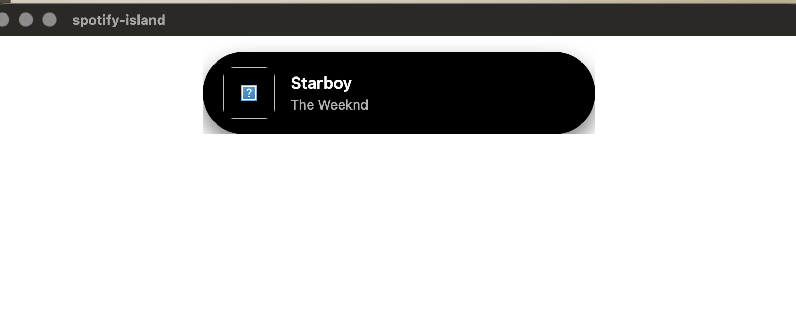

# Spotify Dynamic Island 🏝️

A lightweight, cross-platform desktop widget inspired by Apple's Dynamic Island and Samsung's Now Bar. Built to provide a persistent, unobtrusive, and fluid media status indicator overlay for macOS and Windows.

## The Architecture
Traditional desktop applications often rely on heavy UI frameworks (like C++ or C#). To keep this widget incredibly lightweight and memory-efficient, I utilized **Tauri**. 
* **Backend:** Rust is used to interface directly with the OS, rendering a frameless, transparent, and 'always-on-top' window.
* **Frontend:** Standard web technologies (HTML, CSS, JavaScript) handle the fluid physics-based state transitions.

## Key Technical Features
* **Custom Window Management:** Bypasses standard OS window decorations for a pure floating UI.
* **Physics-Based Animations:** Utilizes CSS `cubic-bezier` timing functions to replicate the organic, spring-loaded expansion of mobile UI elements.
* **State Management:** Seamlessly crossfades between a compact icon state and an expanded media player state without JavaScript overhead, relying entirely on CSS pseudo-classes.

## Tech Stack
* **Framework:** Tauri
* **System Layer:** Rust
* **UI/UX:** HTML5 & CSS3